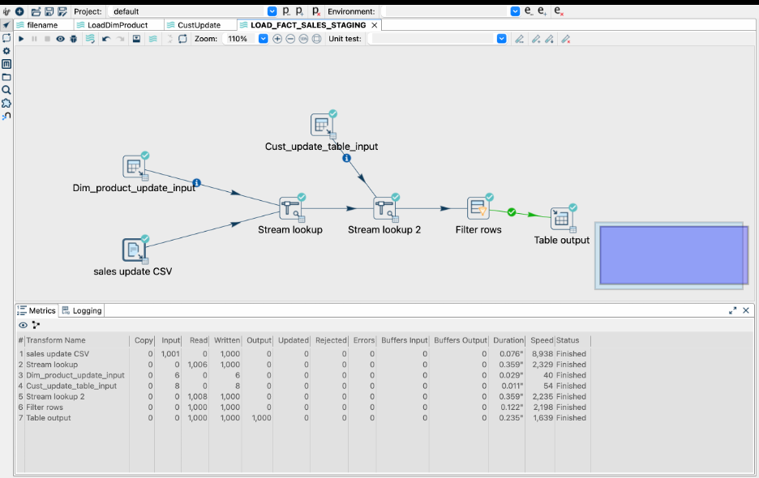
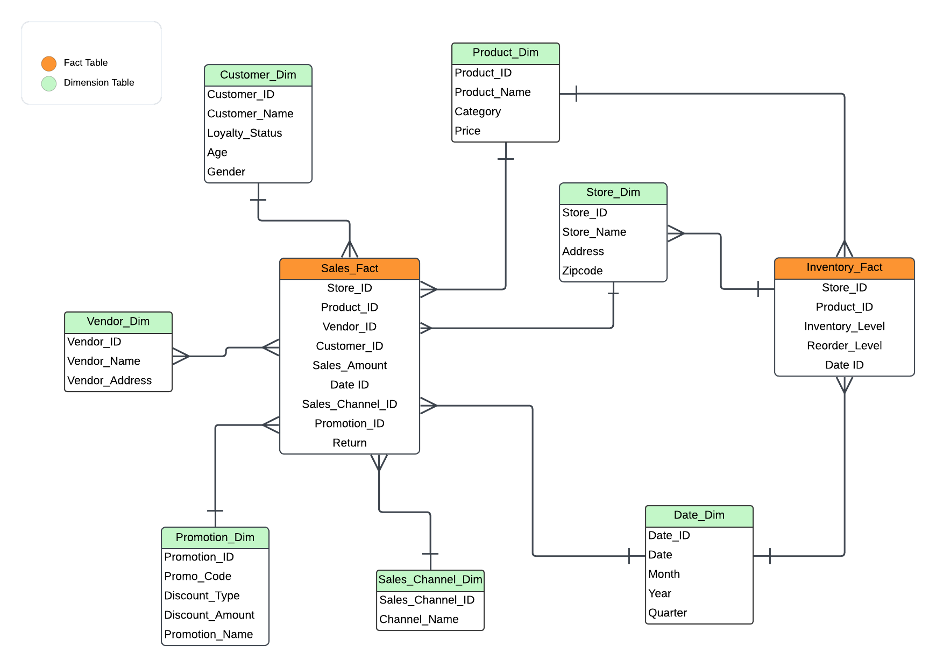
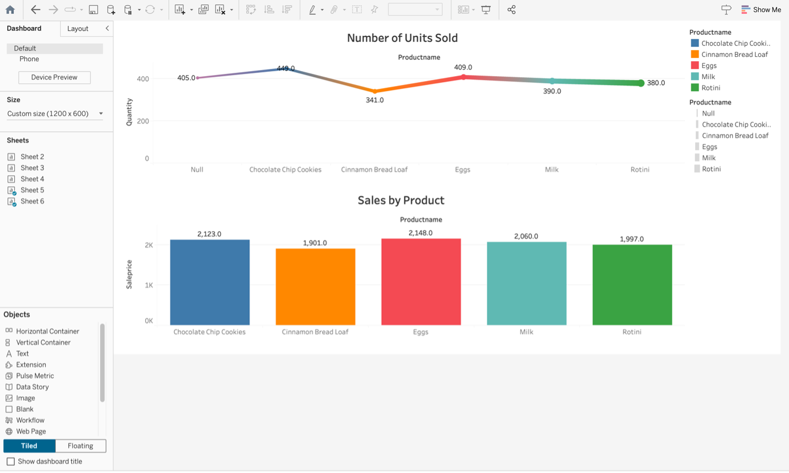

# 🥑 The Guac Shop

This project showcases the full pipeline of modern data warehousing using **Apache Hop**, **Oracle Cloud**, and **Tableau**. It includes designing ETL workflows, creating dimensional models, and visualizing the results using interactive dashboards.

---

## 🧠 Project Overview

The goal was to build an end-to-end cloud data warehousing solution:
- Extract, Transform, Load (ETL) operations using **Apache Hop**
- Cloud-based data modeling and loading into **Oracle Cloud**
- Creating a connected live dashboard in **Tableau** for real-time insights

---

## 🛠 Tech Stack

- **Apache Hop** – ETL pipeline development
- **Oracle Cloud** – Cloud data warehousing and SQL processing
- **Tableau** – Data visualization and dashboarding
- **SQL** – Dimensional modeling and querying
- **Jupyter/Docs** – Report documentation

---

## 📊 Key Activities

### 🔄 ETL & Data Modeling
- Built dimensional models with **Slowly Changing Dimensions (SCD)**
- Created **fact tables** using transactional and dimension data
- Developed pipelines to load data into Oracle Cloud using loaders

### 🧪 Oracle Cloud & SQL
- Loaded and validated data using `SELECT * FROM` queries
- Used lookup strategies to avoid heavy constraints like foreign keys
- Populated fact and dimension tables (Product, Customer, Date, etc.)

### 📈 Tableau Visualization
- Connected Tableau to Oracle Cloud via secure live connection
- Created dashboards using:
  - Bar charts, line graphs, KPI summaries
  - Dynamic filters, tooltips, calculated fields
- Explored forecast models using additive seasonality

---

## 📷 Screenshots

### 📌 ETL Workflow in Apache Hop

### 🗃 Sample Dimensional Table

### 📊 Tableau Dashboard

---

## ✅ Conclusion

The dashboard provides a clear visualization of product-wise performance across sales and unit metrics:

- **Eggs** emerged as the top-selling product with **2,340 units sold**, outperforming other categories both in quantity and revenue.
- **Chocolate Chip Cookies** also performed well with **2,220 units**, followed closely by **Soba**.
- **Cinnamon Bread Loaf** and **Kulcha** had the **lowest unit sales**, signaling opportunities for either promotional efforts or inventory reconsideration.
- The **line chart** illustrates sales trends across the five products, helping identify peak and drop points in unit movement.

These insights can help businesses optimize product stocking, tailor promotional strategies, and understand consumer preferences based on unit-level sales performance.

---

## 👤 Author

**Achyut S Kulkarni**  
📧 achyutsh@buffalo.edu  
🎓 Master's in MIS – University at Buffalo

